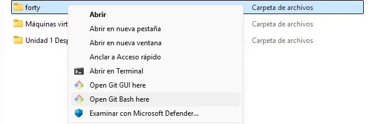
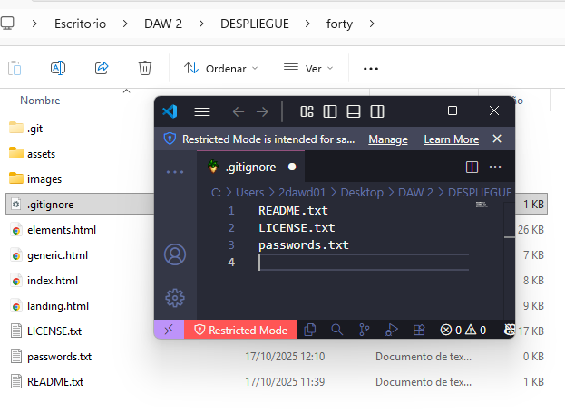

# Práctica GIT (Forty)

## Trabajo en local

1. **Inicializa un nuevo repositorio Git en una carpeta llamada "forty" y agrega los archivos proporcionados en el aula virtual.**

Abrimos Git Bash desde la carpeta donde se encuentran los archivos.



```jsx
git init
git add .
```

1. **Renombra la rama master a main**

```jsx
git branch -m master main
```

1. **Haz que los ficheros README.txt , LICENSE.txt y passwords.txt sean ignorados por el control de versiones**

Añadimos los archivos que queremos ignorar a .gitignore

```
> cat .gitignore
README.txt
LICENSE.txt
passwords.txt
```

Añadimos también el siguiente comando para eliminar del repositorio pero para que permanezca en mi directorio de trabajo como archivo ignorado

```jsx
 git rm --cached README.txt LICENSE.txt
```

Después añadimos .gitignore al repositorio y hacemos un commit

```jsx
git add .gitignore
git commit -m ".gitignore añadido"
```



1. **Crea el archivo passwords.txt . Comprueba que el control de versiones lo ignora**

```jsx
touch passwords.txt
git status
```

1. **Crea una rama llamada "feature-content" . Muévete a esa rama. Cambia, en la línea 3477, el font-size por 1.5em en el archivo main.css . Confirma cambios y haz commit. Muestra los logs de la forma más gráfica posible.**

```jsx
git branch feature-content
git checkout feature-content
git add .
git commit -m "Cambio en la línea 3477 del main.css"
git log
```

1. **Elimina el archivo "passwords.txt" en la carpeta forty . Verifica el estado del repositorio. ¿Hay cambios pendientes?**

```jsx
rm passwords.txt
git add .
git commit -m "Archivo passwords.txt borrado"
git status
```


1. **Crea un nuevo archivo llamado " about.html ", partiendo del archivo generic.html y agrégalo al repositorio, haz un nuevo commit.**

```jsx
cp generic.html about.html
git add .
git commit -m "Archivo about.html creado"
```

1. **Cambia a la rama main . Examina los logs del repositorio de forma gráfica.**

```jsx
git checkout main
git log --graph
```


1. **Modifica algo en el archivo generic.html , comprueba que hay cambios, y realiza otro commit. Examina los logs del repositorio de forma gráfica.**

```jsx
git add .
git commit -m "Cambios en generic.html"
git log --graph
```


1. **Modifica algo en el fichero elements.html . Confirma los cambios, pero no hagas commit.**

```jsx
git add .
```

1. **Mira las diferencias de elements.html . Los cambios no nos gustan, deshaz los cambios de elements.html . Comprueba que no hay cambios pendientes.**

```jsx
git diff elements.html
git checkout -- elements.html
```

1. **Muestra las diferencias entre dos ramas.**

```jsx
git diff main feature-content
```

1. **Fusiona la rama "feature-content" con la rama principal (main). Muestra los logs del repositorio de una forma gráfica y completa.**

```jsx
git commit -m "cambios revertidos"
git merge feature-content
```

1. **Crea una nueva rama llamada " hotfix " y en ella, corrige un error crítico en el archivo "index.html ". (Por ejemplo, añade el enlace a la nueva página about.html)**

```jsx
git branch hotfix
git checkout hotfix
git add index.html
git commit -m "Fix de error crítico"
```

1. **Fusiona la rama "hotfix" con la rama principal y verifica el historial de commits de forma que se vean todas las ramas gráficamente. ¿Borrarías la rama hotfix ? ¿En qué caso? ¿Cómo?**

```jsx
git checkout main
git merge hotfix
```

Si la rama no se va a utilizar más y ya está fusionada con main se puede borrar. Lo haría con el siguiente comando:

```jsx
git branch -d hotfix
```

1. **Muestra el historial de cambios limitado a los últimos 3 commits.**

```jsx
git log -3
```


1. **Etiqueta el commit actual como "v1.0" y muestra las etiquetas existentes.**

```jsx
git tag v1.0
git tag
```


## Trabajo en remoto

1.  **Sube al remoto los ficheros de tu repositorio local.**

```jsx
git remote add origin https://github.com/AlbaAlonsoGlez/forty.git
git branch -M main
git push -u origin main
```


1. **En local, crea una rama 'feature-head'. Cambia el título en la sección head de index.html , borra los comentarios del head , o previos, también. Confirma y sube los cambios al remoto.**

```jsx
git branch feature-head
git checkout feature-head
```


1. **En remoto, crea una rama 'feature-articulo'. Duplica la página generic , nómbrala como articulo.html , y añade como contenido un artículo sobre Git. Confirma los cambios y realiza un commit. Muestra los commits del repositorio tal como se ven en GitHub.**


1. **En el repositorio local examina los cambios. Actualiza el repositorio con el remoto. Fusiona en 'main' las dos ramas 'feature'. Crea la etiqueta 'v2.0'. Muestra los logs, commits, etiquetas y ramas actuales, en local y en remoto.**

```jsx
git status
git log --graph
git fetch origin
git pull origin main
git merge feature-main
git merge feature-articulo
git tag v2.0
git tag
git push tag v2.0
git log --graph
```


1. **En tu copia local, crea una rama nueva . En la rama nueva, cambia los enlaces de la página index.html para que apunten correctamente a la nueva página articulo.html . Confirma los cambios.**

```jsx
git branch enlaces
git checkout enlaces
git add .
git commit -m "Enlaces cambiados"
```

1. **Muestra los logs de forma que se vean las ramas en tu copia local.**

```jsx
git log --graph
```

1. **Te gusta el resultado de los cambios. Incorpora los cambios de la rama nueva a la principal.**

```jsx
git checkout main
git merge enlaces
```

1. **Sube los cambios al remoto borrando la rama nueva , si es necesario. Comprueba primero con un comando en local, las ramas que hay en el repositorio remoto.**

```jsx
git push origin main
git branch -d enlaces
git branch -r
git push origin --delete enlaces
```


1. **Muestra en local los cambios en el archivo index.html entre la versión actual y la anterior.**

```jsx
git diff index.html

```

1. **En el repositorio en GitHub, navega hasta el archivo index.html y selecciona la opción "History".**

