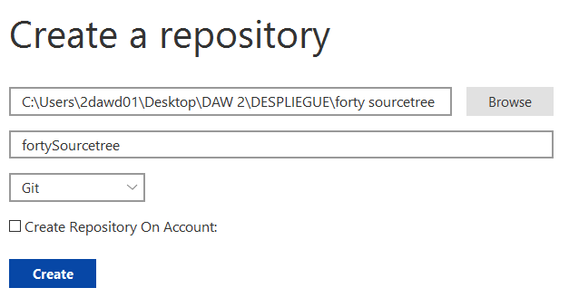

# Práctica SourceTree GIT (Forty)

## Trabajo en local

1. **Inicializa un nuevo repositorio Git en una carpeta llamada "forty" y agrega los archivos proporcionados en el aula virtual.**

Abrimos Sourcetree y le damos a add, escogemos la carpeta de forty y creamos el respositorio. Hacemos un commit para añadir todos los archivos.

1. **Renombra la rama master a main**

1. **Haz que los ficheros README.txt , LICENSE.txt y passwords.txt sean ignorados por el control de versiones**

Creamos el archivo .gitignore, añadimos los ficheros a ignorar y hacemos commit.

Haciendo click derecho en los archivos a ignorar, podemos marcar la opción de ignore.

1. **Crea el archivo passwords.txt . Comprueba que el control de versiones lo ignora**

Tras crear el archivo, comprobamos su status en SourceTree y vemos que aparece en ignored

1. **Crea una rama llamada "feature-content" . Muévete a esa rama. Cambia, en la línea 3477, el font-size por 1.5em en el archivo main.css . Confirma cambios y haz commit. Muestra los logs de la forma más gráfica posible.**

Tras hacer el cambio, hacemos commit

