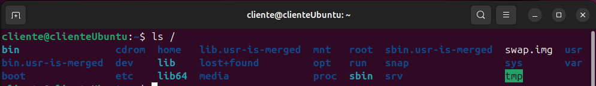

# Capítulo 2 - Manual práctico de Linux

## Ejercicios iniciales

**Muestra el contenido del directorio actual y luego el contenido del directorio que está justo a un nivel superior**

```powershell
ls
ls ..
```


**¿En qué día de la semana naciste?, utiliza la instrucción cal para averiguarlo.**

```powershell
cal -d 2002-02-08
```


**Muestra los archivos del directorio `/bin`**

```powershell
ls /bin
```


**Suponiendo que te encuentras en tu directorio personal (`/home/nombre`), muestra un listado del contenido de `/usr/bin`**

- **Con una sola línea de comando**

```powershell
ls /usr/bin
```


- **Moviéndote paso a paso por los directorios**

```powershell
cd ..
cd ..
cd usr
cd bin
ls
```


- **Con dos líneas de comandos.**

```powershell
cd /usr/bin
ls
```


**Muestra todos los archivos que hay en `/etc` y todos los que hay dentro de cada subdirectorio, de forma recursiva (con un solo comando).**

```powershell
ls /etc/*/
```


**Muestra todos los archivos del directorio /etc ordenados por tamaño (de mayor a menor) junto con el resto de características, es decir, permisos, tamaño, fechas de la última modificación, etc. El tamaño de cada fichero debe aparecer en un formato “legible”, o sea, expresado en Kb, Mb, etc.**

```powershell
ls  -l -h -S -s /etc
```


**Muestra todos los archivos del directorio `/bin` ordenados por tamaño (de menor a mayor). Sólo debe aparecer el tamaño y el nombre de cada fichero, sin ninguna otra información adicional. El tamaño de cada fichero debe aparecer en un formato “legible”, o sea, expresado en Kb, Mb, etc.**

```powershell
ls -h -Sr -s /bin
```


**Muestra el contenido del directorio raíz utilizando como argumento de `ls` una ruta absoluta.**

```powershell
ls /
```



**Muestra el contenido del directorio raíz utilizando como argumento de `ls` una ruta relativa. Suponemos que el directorio actual es `/home/elena/documentos`.**

```powershell
ls ../../../
```


**Crea el directorio `gastos` dentro del directorio personal.**

```powershell
mkdir gastos
```

