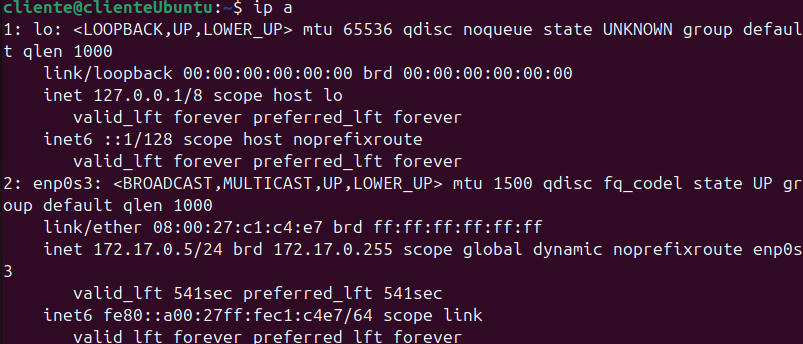
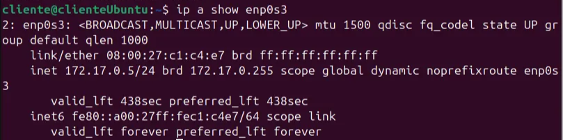

# Ejercicios de redes de Linux

## **Cuestiones sobre Comandos de Red en Linux**

**Muestra todas las interfaces de red activas y sus direcciones IP en el sistema.**

```powershell
ip a
```



**¿Cómo mostrarías solo la información de la interfaz de red `eth0` usando `ip a`?**

```powershell
ip a show enp0s3
```



**Configura manualmente la dirección IP `192.168.1.100/24` en la interfaz `eth0` con `ifconfig`.**

```powershell
sudo ifconfig enp0s3 192.168.1.100 netmask 255.255.255.0 up
```


**Envía 10 paquetes ICMP a la dirección IP `8.8.8.8` usando `ping`.**

```powershell
ping -c 10 8.8.8.8
```


**Consulta la dirección IP de `www.example.com` usando `nslookup`.**

```powershell
nslookup www.example.com
```


**Muestra las conexiones TCP activas en el sistema usando `netstat`.**

```powershell
netstat -t
```


**Descarga el contenido de la página principal de `www.example.com` usando `curl` y guárdalo en un archivo llamado `example.html`.**

```powershell
curl -o example.html https://www.example.com
```


**Consulta el nombre del host actual del sistema.**

```powershell
hostname
```


**Obtén la información de registro del dominio `example.com` usando `whois`.**

```powershell
whois example.com
```


**Cambia temporalmente el nombre del host a `servidor01` usando `hostname`.**

```powershell
sudo hostname servidor01
```


**Envía un ping a la dirección `192.168.1.1` y muéstralo en modo detallado (verbose).**

```powershell
ping -v 192.168.1.1
```

**Muestra las estadísticas de la red, como la cantidad de paquetes transmitidos, usando `netstat`.**

```powershell
netstat -s
```

**Realiza una consulta inversa para obtener el nombre de dominio asociado a la IP `8.8.8.8` con `nslookup`.**

```powershell
nslookup 8.8.8.8
```

**Configura temporalmente la máscara de subred `255.255.255.128` en la interfaz `eth1` usando `ifconfig`.**

```powershell
sudo ifconfig eth1 netmask 255.255.255.128 up
```

**Muestra las rutas de enrutamiento actuales usando `netstat`.**

```powershell
netstat -r
```

**Realiza una solicitud HTTP GET a la API de GitHub para obtener los repositorios de `usuario123` usando `curl`.**

```powershell
curl https://api.github.com/users/usuario123/repos
```

**Envía un ping a la dirección `2001:4860:4860::8888` (IPv6 de Google) con `ping6` y limita los paquetes a 4.**

```powershell
ping6 -c 4 2001:4860:4860::8888
```

**Obtén las estadísticas de los sockets activos en el sistema con `netstat`.**

```powershell
netstat -an
```

**Cambia temporalmente la dirección MAC de la interfaz `eth0` a `00:11:22:33:44:55` usando `ifconfig`.**

```powershell
sudo ifconfig enp0s3 down
sudo ifconfig enp0s3 hw ether 00:11:22:33:44:55
sudo ifconfig enp0s3 up
```

**Realiza una solicitud HTTP POST a `https://httpbin.org/post` enviando el usuario `admin` y la contraseña `12345` usando `curl`.**

```powershell
curl -X POST -d "usuario=admin&contraseña=12345" https://httpbin.org/post
```

**Consulta el nombre de dominio completo (FQDN) de tu sistema usando `hostname`.**

```powershell
hostname -f
```

**Muestra solo las conexiones activas en la interfaz `eth0` usando `netstat`.**

```powershell
sudo netstat -i | grep enp0s3
```

**Muestra las conexiones activas con nombres de dominio en lugar de direcciones IP usando `netstat`.**

```powershell
netstat -a
```


**Configura una nueva puerta de enlace predeterminada con la dirección `192.168.1.1` usando `ip route`.**

```powershell
sudo ip route add default via 192.168.1.1 dev enp0s3
```

**¿Qué comando usarías para ver todas las rutas configuradas en tu sistema?**

```powershell
ip route show
```

**¿Cómo configuras que todo el tráfico destinado a la red `10.10.10.0/24` pase por el gateway `192.168.1.1` en la interfaz `eth0`?**

```powershell
sudo ip route add 10.10.10.0/24 via 192.168.1.1 dev enp0s3
```

**¿Cómo eliminas la ruta añadida en el ejercicio anterior?**

```powershell
sudo ip route del 10.10.10.0/24
```

**Si la interfaz `eth0` está deshabilitada, ¿qué comando usarías para levantarla?**

```powershell
sudo ip link set enp0s3 up
```

**¿Qué comando utilizas para asignar la dirección MAC `02:1A:2B:3C:4D:5E` a la interfaz `eth0`?**

```powershell
sudo ifconfig enp0s3 down
sudo ifconfig enp0s3 hw ether 02:1A:2B:3C:4D:5E
sudo ifconfig enp0s3 up
```

**¿Cómo renombrarías la interfaz `eth0` para que pase a llamarse `lan0`?**

```powershell
sudo ip link set enp0s3 down
sudo ip link set enp0s3 name lan0
sudo ip link set lan0 up
```

